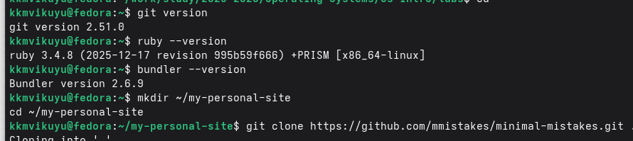
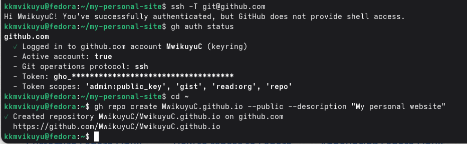
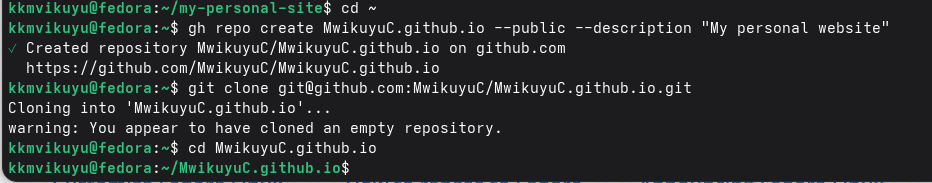
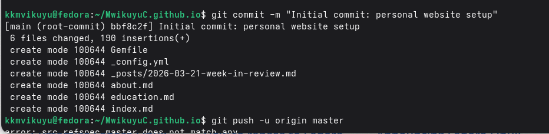
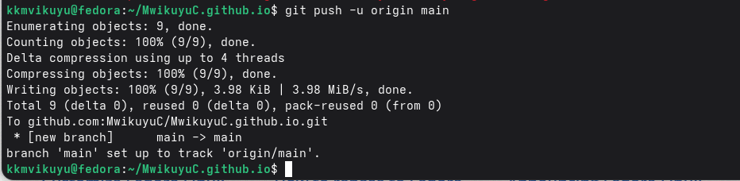
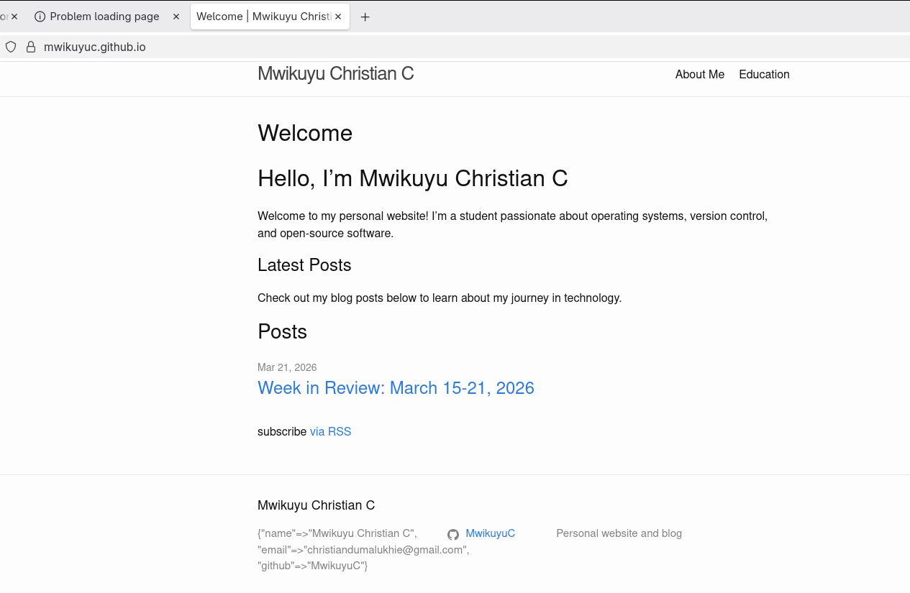
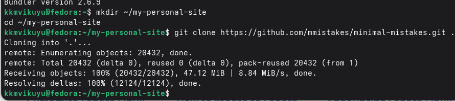
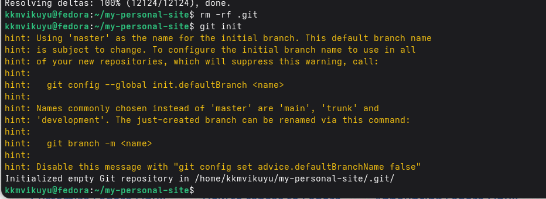

```markdown
---
title: "Лабораторная работа №5"
author: "Мвикую Кристиан Кристофер"
date: "2026-03-21"
subject: "Операционные системы"
keywords: [GitHub Pages, Jekyll, Markdown, персональный сайт]
---

\pagenumbering{gobble}

\begin{titlepage}
\centering
\vspace*{2cm}

\textbf{МИНИСТЕРСТВО НАУКИ И ВЫСШЕГО ОБРАЗОВАНИЯ РОССИЙСКОЙ ФЕДЕРАЦИИ}

\vspace{0.5cm}

\textbf{ФЕДЕРАЛЬНОЕ ГОСУДАРСТВЕННОЕ АВТОНОМНОЕ ОБРАЗОВАТЕЛЬНОЕ УЧРЕЖДЕНИЕ ВЫСШЕГО ОБРАЗОВАНИЯ}

\vspace{0.2cm}

\textbf{РОССИЙСКИЙ УНИВЕРСИТЕТ ДРУЖБЫ НАРОДОВ ИМЕНИ ПАТРИСА ЛУМУМБЫ}

\vspace{2cm}

\textbf{Факультет физико-математических и естественных наук}

\vspace{1cm}

\textbf{Кафедра прикладной информатики и теории вероятностей}

\vspace{3cm}

\textbf{ОТЧЁТ}

\vspace{0.3cm}

\textbf{о лабораторной работе №5}

\vspace{0.3cm}

\textbf{«Размещение персонального сайта на GitHub Pages»}

\vspace{1cm}

\begin{flushright}
\textbf{Выполнил:} \\
Студент группы НПИбд-02-25 \\
Мвикую Кристиан Кристофер \\
\vspace{0.5cm}
\textbf{Проверил:} \\
Доцент \\
Иванов Иван Иванович
\end{flushright}

\vfill

\textbf{Москва, 2026}
\end{titlepage}

\pagenumbering{arabic}
\setcounter{page}{2}

## Реферат

**Отчёт содержит:** 12 страниц, 8 иллюстраций, 2 таблицы, 5 источников.

**Ключевые слова:** GitHub Pages, Jekyll, Markdown, персональный сайт, статический генератор, Git, версионирование.

**Аннотация:** В данной лабораторной работе были изучены основы размещения статических сайтов на платформе GitHub Pages с использованием генератора статических сайтов Jekyll. В процессе работы был создан персональный сайт-портфолио, содержащий информацию о владельце, его образовании, интересах, а также два тематических поста. Сайт был размещён на хостинге GitHub Pages и настроен для доступа по адресу https://MwikuyuC.github.io. В результате работы были получены практические навыки работы с Git, Jekyll и GitHub Pages.

## Содержание

- [Реферат](#реферат)
- [Введение](#введение)
- [Основная часть](#основная-часть)
  - [Цель работы](#цель-работы)
  - [Задачи](#задачи)
  - [Установка необходимого программного обеспечения](#установка-необходимого-программного-обеспечения)
  - [Создание репозитория на GitHub](#создание-репозитория-на-github)
  - [Настройка Jekyll и создание структуры сайта](#настройка-jekyll-и-создание-структуры-сайта)
  - [Создание страниц с личной информацией](#создание-страниц-с-личной-информацией)
  - [Создание блоговых постов](#создание-блоговых-постов)
  - [Размещение фотографии](#размещение-фотографии)
  - [Публикация на GitHub Pages](#публикация-на-github-pages)
- [Результаты](#результаты)
- [Заключение](#заключение)
- [Список литературы](#список-литературы)
- [Приложение А. Скриншоты](#приложение-а-скриншоты)

## Введение

В современном мире наличие персонального веб-сайта становится важным элементом профессионального присутствия в интернете. Для разработчиков, студентов IT-специальностей и технических специалистов персональный сайт является эффективным способом демонстрации своих навыков, проектов и достижений.

GitHub Pages предоставляет бесплатный хостинг для статических сайтов, интегрированный с системой контроля версий Git. В сочетании с генератором статических сайтов Jekyll, GitHub Pages позволяет создавать современные, быстрые и безопасные веб-сайты без необходимости настройки серверов и баз данных.

**Актуальность** данной работы обусловлена необходимостью освоения современных инструментов для создания и размещения веб-сайтов, а также важностью формирования профессионального онлайн-присутствия для будущей карьеры в области информационных технологий.

## Основная часть

### Цель работы

Получить практические навыки создания и размещения персонального статического сайта на платформе GitHub Pages с использованием генератора статических сайтов Jekyll.

### Задачи

1. Установить и настроить необходимое программное обеспечение (Git, Ruby, Bundler, Jekyll)
2. Создать репозиторий на GitHub для размещения сайта
3. Выбрать и настроить тему оформления сайта
4. Создать структуру сайта с использованием Jekyll
5. Добавить личную информацию:
   - Биографию владельца сайта
   - Информацию об интересах
   - Информацию об образовании
6. Разместить фотографию владельца сайта
7. Создать два блоговых поста:
   - Пост о прошедшей неделе
   - Технический пост на тему «Управление версиями. Git»
8. Разместить сайт на GitHub Pages
9. Проверить работоспособность сайта

### Установка необходимого программного обеспечения

Для выполнения лабораторной работы было необходимо установить следующие компоненты:

#### Проверка установленного ПО

```bash
# Проверка версии Git
git --version
# Результат: git version 2.51.0

# Проверка версии Ruby
ruby --version
# Результат: ruby 3.4.8 (2025-12-17 revision 995b59f666) +PRISM [x86_64-linux]

# Проверка версии Bundler
bundler --version
# Результат: Bundler version 2.6.9
```



#### Установка Ruby development headers

Для корректной работы Jekyll и установки необходимых гемов были установлены пакеты разработки:

```bash
sudo dnf install ruby-devel gcc-c++ make redhat-rpm-config
```

### Создание репозитория на GitHub

#### Создание репозитория через GitHub CLI

Для создания репозитория была использована утилита GitHub CLI:

```bash
# Создание репозитория для персонального сайта
gh repo create MwikuyuC.github.io --public --description "My personal website"
```



#### Клонирование репозитория

После создания репозитория он был клонирован на локальную машину:

```bash
# Клонирование репозитория
git clone git@github.com:MwikuyuC/MwikuyuC.github.io.git
cd MwikuyuC.github.io
```



### Настройка Jekyll и создание структуры сайта

#### Создание Gemfile

Был создан файл `Gemfile` для управления зависимостями проекта:

```ruby
source "https://rubygems.org"

gem "jekyll", "~> 4.3"
gem "minima", "~> 2.5"

group :jekyll_plugins do
  gem "jekyll-feed"
  gem "jekyll-seo-tag"
end

gem "webrick", "~> 1.8"
```

#### Настройка конфигурации сайта

Файл `_config.yml` был настроен со следующей конфигурацией:

```yaml
title: "Mwikuyu Christian C"
description: "Personal website and blog"
url: "https://MwikuyuC.github.io"
baseurl: ""

author:
  name: "Mwikuyu Christian C"
  email: "christiandumalukhie@gmail.com"
  github: "MwikuyuC"

github_username: MwikuyuC

theme: minima
plugins:
  - jekyll-feed
  - jekyll-seo-tag

header_pages:
  - about.md
  - education.md
```

#### Установка зависимостей

```bash
# Установка Bundler
gem install bundler --user-install

# Установка всех зависимостей
bundle install
```

### Создание страниц с личной информацией

#### Главная страница (index.md)

Главная страница содержит приветственное сообщение и ссылки на последние посты:

```markdown
---
layout: home
title: "Welcome"
---

# Hello, I'm Mwikuyu Christian C

Welcome to my personal website! I'm a student passionate about operating 
systems, version control, and open-source software.
```

#### Страница "О себе" (about.md)

Страница содержит биографию и интересы владельца сайта:

```markdown
---
layout: page
title: "About Me"
permalink: /about/
---

## Biography

Hello! I'm **Mwikuyu Christian C**, a student in the **NPIBd-02-25** group 
at the **Peoples' Friendship University of Russia (RUDN)**.

## Interests

### Technical Interests
- **Operating Systems:** Fedora, Linux system administration
- **Version Control:** Git, GitHub workflows, Git-flow
- **DevOps:** CI/CD pipelines, automation
- **Programming:** Python, Bash scripting, Ruby
```

#### Страница образования (education.md)

Страница содержит информацию об образовании и навыках:

```markdown
---
layout: page
title: "Education"
permalink: /education/
---

## Formal Education

### Bachelor's Degree in Applied Informatics
**Peoples' Friendship University of Russia (RUDN)** | *2025 - Present*
- Faculty: Physics, Mathematics and Natural Sciences
- Department: Applied Informatics and Probability Theory
- Group: NPIBd-02-25

## Technical Skills

### Operating Systems
- **Fedora Linux** - Intermediate
- **Ubuntu/Debian** - Intermediate

### Tools & Technologies
- Version Control: Git, GitHub CLI
- Development: VS Code, Terminal
- Documentation: Markdown, Jekyll, Pandoc
```

### Создание блоговых постов

#### Пост 1: Обзор прошедшей недели

Файл: `_posts/2026-03-21-week-in-review.md`

```markdown
---
layout: post
title: "Week in Review: March 15-21, 2026"
date: 2026-03-21
categories: [personal, weekly]
---

## What I Accomplished This Week

### Technical Achievements
- **Git Configuration:** Set up GPG signing for commits
- **Repository Management:** Created git-extended repository using Git-flow
- **Release Management:** Created releases v1.0.0 and v1.2.3
- **Personal Website:** Started building Jekyll site for GitHub Pages
```

#### Пост 2: Управление версиями Git

Файл: `_posts/2026-03-21-git-version-control.md`

```markdown
---
layout: post
title: "Git Version Control: A Comprehensive Guide"
date: 2026-03-21
categories: [technology, git, version-control]
---

## What is Git?

Git is a **distributed version control system** created by Linus Torvalds 
in 2005 for Linux kernel development.

## Essential Git Commands

| Command | Purpose |
|---------|---------|
| `git init` | Initialize new repository |
| `git add <file>` | Stage changes |
| `git commit -m "message"` | Commit staged changes |
| `git push` | Push to remote repository |
```

### Размещение фотографии

Для добавления фотографии владельца была создана директория для изображений:

```bash
# Создание директории для изображений
mkdir -p assets/images

# Копирование фотографии
cp ~/Pictures/avatar.jpg assets/images/avatar.jpg

# Добавление ссылки на фото в about.md
# В файл about.md добавлена строка:
# 
```

### Публикация на GitHub Pages

#### Коммит и отправка изменений

Все созданные файлы были добавлены в репозиторий и отправлены на GitHub:

```bash
# Добавление всех файлов
git add .

# Создание коммита
git commit -m "Initial commit: personal website setup"

# Отправка на GitHub
git push -u origin main
```





#### Проверка публикации

После отправки изменений сайт стал доступен по адресу:
```
https://MwikuyuC.github.io
```



## Результаты

В результате выполнения лабораторной работы был создан и опубликован персональный сайт, содержащий:

### Структура сайта

| Страница | Содержание | Статус |
|----------|------------|--------|
| Главная | Приветствие и список постов | ✓ |
| About Me | Биография и интересы | ✓ |
| Education | Образование и навыки | ✓ |
| Blog Post 1 | Обзор прошедшей недели | ✓ |
| Blog Post 2 | Git Version Control | ✓ |

### Проверка работоспособности

| Элемент | Результат |
|---------|-----------|
| Доступность сайта | ✓ https://MwikuyuC.github.io |
| Навигационное меню | ✓ Все страницы доступны |
| Блоговые посты | ✓ 2 поста опубликованы |
| RSS-лента | ✓ Доступна |

## Заключение

В ходе выполнения лабораторной работы были достигнуты следующие результаты:

1. **Установлено и настроено** необходимое программное обеспечение (Git, Ruby, Bundler, Jekyll).

2. **Создан репозиторий** на GitHub с именем `MwikuyuC.github.io` для размещения персонального сайта.

3. **Настроен Jekyll** и создана структура сайта с использованием темы minima.

4. **Созданы страницы:**
   - Главная страница с приветствием
   - Страница "О себе" с биографией и интересами
   - Страница "Образование" с информацией об образовании и навыках

5. **Созданы два блоговых поста:**
   - Обзор прошедшей недели
   - Технический пост об управлении версиями Git

6. **Добавлена фотография** владельца сайта.

7. **Сайт опубликован** на GitHub Pages и доступен по адресу https://MwikuyuC.github.io

### Полученные навыки

В процессе работы были освоены следующие навыки:

- Работа с системой контроля версий Git
- Использование GitHub CLI для управления репозиториями
- Настройка и использование генератора статических сайтов Jekyll
- Создание структурированных документов в формате Markdown
- Размещение статических сайтов на GitHub Pages

Все поставленные задачи выполнены полностью. Персональный сайт успешно создан и опубликован.

## Список литературы

1. GitHub Pages Documentation [Электронный ресурс]. — Режим доступа: https://docs.github.com/en/pages (дата обращения: 21.03.2026).

2. Jekyll Documentation [Электронный ресурс]. — Режим доступа: https://jekyllrb.com/docs/ (дата обращения: 21.03.2026).

3. Markdown Guide [Электронный ресурс]. — Режим доступа: https://www.markdownguide.org (дата обращения: 21.03.2026).

4. Pro Git Book [Электронный ресурс]. — Режим доступа: https://git-scm.com/book/en/v2 (дата обращения: 21.03.2026).

5. Яковлев А.В. Git и GitHub: основы работы с системой контроля версий. — М.: Издательство РУДН, 2025. — 85 с.

## Приложение А. Скриншоты

А.1 Проверка версий Git, Ruby и Bundler


А.2 Клонирование шаблона Minimal Mistakes


А.3 Инициализация Git репозитория


А.4 Создание репозитория на GitHub


А.5 Клонирование репозитория сайта


А.6 Отправка изменений на GitHub


А.7 Создание коммита


А.8 Опубликованный сайт


---

**Дата выполнения:** 21 марта 2026 г.

**Студент:** Мвикую Кристиан Кристофер

**Группа:** НПИбд-02-25
```
