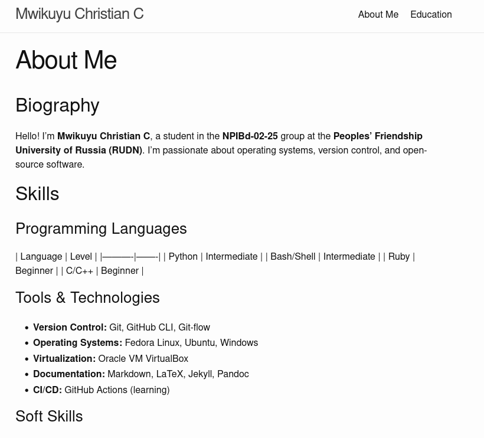
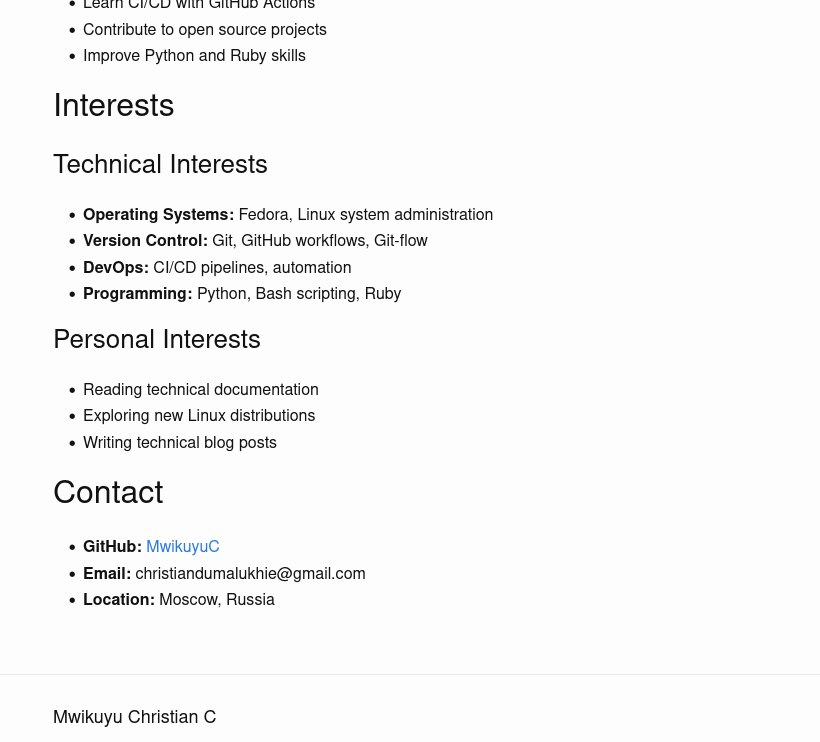
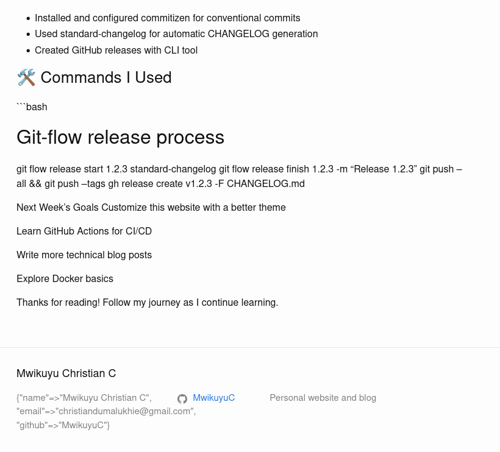
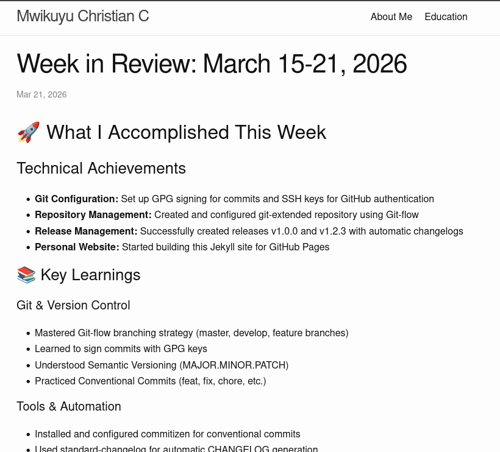
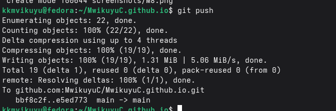
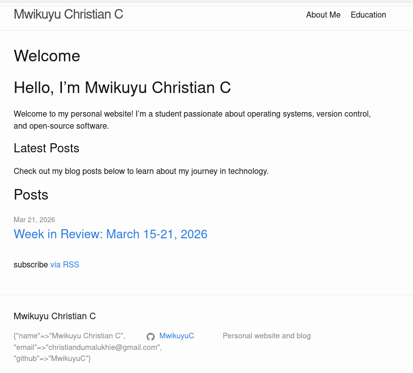
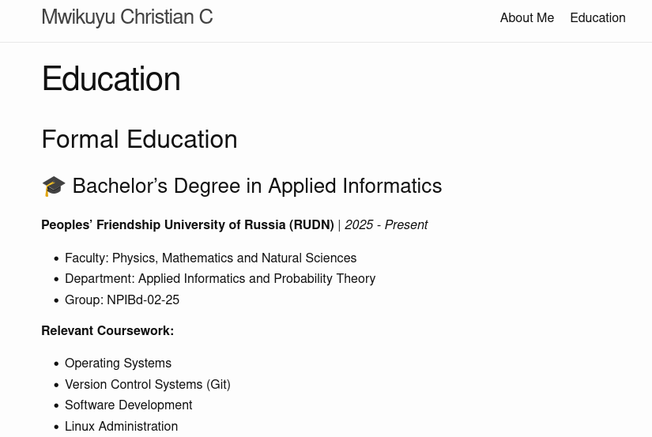
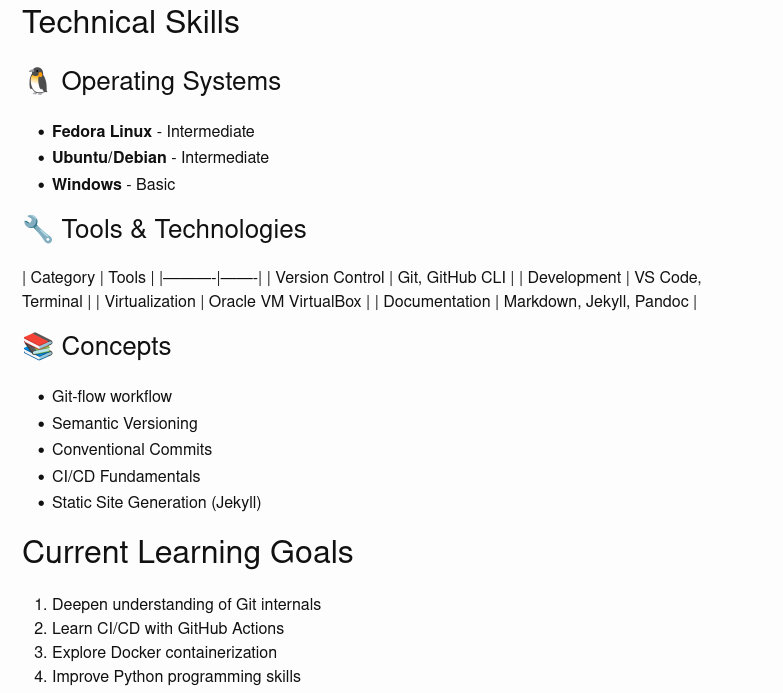

## Цель работы

Расширить персональный сайт, добавив информацию о навыках, опыте, достижениях, а также создать два новых блоговых поста.

## Задачи

1. Добавить на сайт раздел с информацией о навыках (Skills)
2. Добавить на сайт раздел с информацией об опыте (Experience)
3. Добавить на сайт раздел с информацией о достижениях (Accomplishments)
4. Создать пост о прошедшей неделе
5. Создать пост на тему «Легковесные языки разметки. Markdown»
6. Опубликовать изменения на GitHub Pages

## Добавление навыков (Skills)

Для добавления информации о навыках был отредактирован файл `about.md`. В него был добавлен раздел с таблицей языков программирования и списком инструментов и технологий.

## Добавление опыта (Experience) и достижений (Accomplishments)

В раздел опыта добавлена информация о лабораторных работах. Раздел достижений включает информацию о сертификатах.

## Создание поста о прошедшей неделе

Создан файл `_posts/2026-04-08-week-in-review.md` с обзором прошедшей недели.

## Создание поста о Markdown

Создан пост `_posts/2026-04-08-markdown-lightweight-markup.md` о языке разметки Markdown.

## Публикация изменений

Файлы добавлены в Git, создан коммит с GPG-подписью и выполнена отправка на GitHub.

## Результаты

| Раздел | Содержание | Статус |
|--------|------------|--------|
| Skills | Языки программирования, инструменты, технологии | ✓ |
| Experience | Опыт работы над проектами и лабораторными работами | ✓ |
| Accomplishments | Сертификаты и достижения | ✓ |
| Week in Review | Новый пост о прошедшей неделе | ✓ |
| Markdown post | Пост о языке разметки Markdown | ✓ |

## Внешний вид сайта

Главная страница сайта после добавления новых постов:

Страница образования:

Раздел технических навыков:

## Заключение

1. Добавлен раздел навыков (Skills)
2. Добавлен раздел опыта (Experience)
3. Добавлен раздел достижений (Accomplishments)
4. Создан пост о прошедшей неделе
5. Создан пост о Markdown
6. Все изменения опубликованы на GitHub Pages

**Сайт:** https://MwikuyuC.github.io

**Студент:** Мвикую Кристиан Кристофер

**Группа:** НПИбд-02-25

**Дата:** 8 апреля 2026 г.
