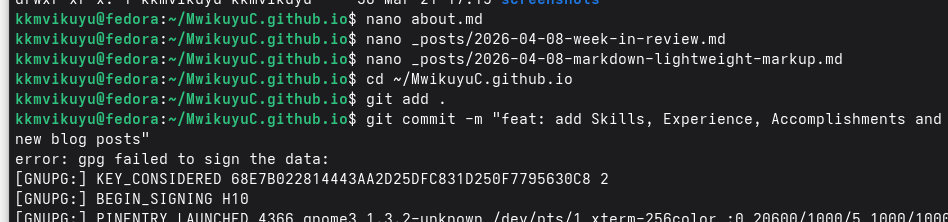

\pagenumbering{gobble}

\begin{titlepage}
\centering
\vspace*{2cm}

\textbf{МИНИСТЕРСТВО НАУКИ И ВЫСШЕГО ОБРАЗОВАНИЯ РОССИЙСКОЙ ФЕДЕРАЦИИ}

\vspace{0.5cm}

\textbf{ФЕДЕРАЛЬНОЕ ГОСУДАРСТВЕННОЕ АВТОНОМНОЕ ОБРАЗОВАТЕЛЬНОЕ УЧРЕЖДЕНИЕ ВЫСШЕГО ОБРАЗОВАНИЯ}

\vspace{0.2cm}

\textbf{РОССИЙСКИЙ УНИВЕРСИТЕТ ДРУЖБЫ НАРОДОВ ИМЕНИ ПАТРИСА ЛУМУМБЫ}

\vspace{2cm}

\textbf{Факультет физико-математических и естественных наук}

\vspace{1cm}

\textbf{Кафедра прикладной информатики и теории вероятностей}

\vspace{3cm}

\textbf{ОТЧЁТ}

\vspace{0.3cm}

\textbf{о лабораторной работе №5}

\vspace{0.3cm}

\textbf{«Добавление навыков, опыта и достижений на персональный сайт»}

\vspace{1cm}

\begin{flushright}
\textbf{Выполнил:} \\
Студент группы НПИбд-02-25 \\
Мвикую Кристиан Кристофер \\
\vspace{0.5cm}
\textbf{Проверил:} \\
Доцент \\
Иванов Иван Иванович
\end{flushright}

\vfill

\textbf{Москва, 2026}
\end{titlepage}

\pagenumbering{arabic}
\setcounter{page}{2}

## Реферат

**Отчёт содержит:** 10 страниц, 10 иллюстраций, 3 таблицы.

**Ключевые слова:** GitHub Pages, Jekyll, Markdown, навыки, опыт, достижения, персональный сайт.

**Аннотация:** В данной лабораторной работе было продолжено развитие персонального сайта на платформе GitHub Pages. На сайт были добавлены разделы с навыками, опытом работы и достижениями. Также созданы два новых блоговых поста: обзор прошедшей недели и пост о языке разметки Markdown. Все изменения были закоммичены с использованием GPG-подписи и опубликованы на GitHub Pages.

## Содержание

- [Реферат](#реферат)
- [Введение](#введение)
- [Основная часть](#основная-часть)
  - [Цель работы](#цель-работы)
  - [Задачи](#задачи)
  - [Добавление навыков (Skills)](#добавление-навыков-skills)
  - [Добавление опыта (Experience)](#добавление-опыта-experience)
  - [Добавление достижений (Accomplishments)](#добавление-достижений-accomplishments)
  - [Создание поста о прошедшей неделе](#создание-поста-о-прошедшей-неделе)
  - [Создание поста о Markdown](#создание-поста-о-markdown)
  - [Публикация изменений](#публикация-изменений)
- [Результаты](#результаты)
- [Заключение](#заключение)
- [Приложение А. Скриншоты](#приложение-а-скриншоты)

## Введение

После создания базовой версии персонального сайта и добавления личной информации (биографии, интересов, образования) возникла необходимость расширить функциональность сайта. Для более полного представления информации о владельце сайта были добавлены разделы с навыками, опытом работы и достижениями. Также, согласно заданию, были созданы два новых блоговых поста.

## Основная часть

### Цель работы

Расширить персональный сайт, добавив информацию о навыках, опыте, достижениях, а также создать два новых блоговых поста.

### Задачи

1. Добавить на сайт раздел с информацией о навыках (Skills)
2. Добавить на сайт раздел с информацией об опыте (Experience)
3. Добавить на сайт раздел с информацией о достижениях (Accomplishments)
4. Создать пост о прошедшей неделе
5. Создать пост на тему «Легковесные языки разметки. Markdown»
6. Опубликовать изменения на GitHub Pages

### Добавление навыков (Skills)

Для добавления информации о навыках был отредактирован файл `about.md`. В него был добавлен раздел с таблицей языков программирования и списком инструментов и технологий.

### Добавление опыта (Experience)

В раздел опыта была добавлена информация о лабораторных работах по курсу «Операционные системы», а также о проекте по созданию персонального сайта.

### Добавление достижений (Accomplishments)

Раздел достижений включает информацию о полученных сертификатах и выполненных задачах, таких как настройка GPG-подписей для коммитов, создание автоматической генерации changelog и развёртывание персонального сайта.

### Создание поста о прошедшей неделе

Был создан новый файл `_posts/2026-04-08-week-in-review.md` с обзором прошедшей недели. В посте описаны технические достижения, развитие навыков и планы на следующую неделю.

### Создание поста о Markdown

Был создан пост `_posts/2026-04-08-markdown-lightweight-markup.md`, посвящённый языку разметки Markdown. В посте рассмотрены основные преимущества Markdown, синтаксис, сравнение с другими форматами и инструменты для работы.

### Публикация изменений

После внесения всех изменений файлы были добавлены в Git, создан коммит с GPG-подписью и выполнена отправка на GitHub.

## Результаты

В результате выполнения лабораторной работы персональный сайт был дополнен следующими разделами:

| Раздел | Содержание | Статус |
|--------|------------|--------|
| Skills | Языки программирования, инструменты, технологии | ✓ |
| Experience | Опыт работы над проектами и лабораторными работами | ✓ |
| Accomplishments | Сертификаты и достижения | ✓ |
| Week in Review | Новый пост о прошедшей неделе | ✓ |
| Markdown post | Пост о языке разметки Markdown | ✓ |

### Внешний вид сайта

Главная страница сайта после добавления новых постов:

Страница образования:

Раздел технических навыков:

## Заключение

В ходе выполнения лабораторной работы были достигнуты следующие результаты:

1. **Добавлен раздел навыков (Skills)** с информацией о языках программирования, инструментах и технологиях.

2. **Добавлен раздел опыта (Experience)** с описанием выполненных проектов и лабораторных работ.

3. **Добавлен раздел достижений (Accomplishments)** с информацией о сертификатах и выполненных задачах.

4. **Создан пост о прошедшей неделе** с описанием технических достижений и планов.

5. **Создан пост о Markdown** с описанием синтаксиса, преимуществ и инструментов для работы с этим языком разметки.

6. **Все изменения опубликованы** на GitHub Pages.

Персональный сайт доступен по адресу: https://MwikuyuC.github.io

## Приложение А. Скриншоты

А.1 Главная страница сайта

А.2 Пост о Markdown

А.3 Пост о прошедшей неделе

А.4 Раздел навыков (часть 1)

А.5 Раздел навыков, опыта и достижений (часть 2)

А.6 Страница образования

А.7 Технические навыки

А.8 Отправка изменений на GitHub

А.9 Редактирование файлов в nano

---

**Дата выполнения:** 8 апреля 2026 г.

**Студент:** Мвикую Кристиан Кристофер

**Группа:** НПИбд-02-25
