\pagenumbering{gobble}

\begin{titlepage}
\centering
\vspace*{2cm}

\textbf{МИНИСТЕРСТВО НАУКИ И ВЫСШЕГО ОБРАЗОВАНИЯ РОССИЙСКОЙ ФЕДЕРАЦИИ}

\vspace{0.5cm}

\textbf{ФЕДЕРАЛЬНОЕ ГОСУДАРСТВЕННОЕ АВТОНОМНОЕ ОБРАЗОВАТЕЛЬНОЕ УЧРЕЖДЕНИЕ ВЫСШЕГО ОБРАЗОВАНИЯ}

\vspace{0.2cm}

\textbf{РОССИЙСКИЙ УНИВЕРСИТЕТ ДРУЖБЫ НАРОДОВ ИМЕНИ ПАТРИСА ЛУМУМБЫ}

\vspace{2cm}

\textbf{Факультет физико-математических и естественных наук}

\vspace{1cm}

\textbf{Кафедра прикладной информатики и теории вероятностей}

\vspace{3cm}

\textbf{ОТЧЁТ}

\vspace{0.3cm}

\textbf{о лабораторной работе №5}

\vspace{0.3cm}

\textbf{«Добавление ссылок на научные ресурсы и персональных проектов»}

\vspace{1cm}

\begin{flushright}
\textbf{Выполнил:} \\
Студент группы НБИБд-02-25 \\
МВИКУЮ КРИСТИАН КРИСТОФЕР \\
\vspace{0.5cm}
\textbf{Проверил:} \\
Доцент \\
Иванов Иван Иванович
\end{flushright}

\vfill

\textbf{Москва, 2026}
\end{titlepage}

\pagenumbering{arabic}
\setcounter{page}{2}

## Реферат

**Отчёт содержит:** 8 страниц, 10 иллюстраций.

**Ключевые слова:** GitHub Pages, Jekyll, научные ресурсы, ORCID, Google Scholar, ResearchGate, персональные проекты.

**Аннотация:** В данной лабораторной работе на персональный сайт были добавлены ссылки на научные и библиометрические ресурсы (eLibrary, Google Scholar, ORCID, Mendeley, ResearchGate, Academia.edu, arXiv, GitHub). Также создана страница с персональными проектами. Добавлены два новых блоговых поста: обзор прошедшей недели и пост о языках научного программирования.

## Содержание

- [Реферат](#реферат)
- [Введение](#введение)
- [Основная часть](#основная-часть)
  - [Цель работы](#цель-работы)
  - [Задачи](#задачи)
  - [Добавление ссылок на научные ресурсы](#добавление-ссылок-на-научные-ресурсы)
  - [Создание страницы персональных проектов](#создание-страницы-персональных-проектов)
  - [Обновление навигационного меню](#обновление-навигационного-меню)
  - [Создание поста о прошедшей неделе](#создание-поста-о-прошедшей-неделе)
  - [Создание поста о языках научного программирования](#создание-поста-о-языках-научного-программирования)
  - [Публикация изменений](#публикация-изменений)
- [Результаты](#результаты)
- [Заключение](#заключение)
- [Приложение А. Скриншоты](#приложение-а-скриншоты)

## Введение

После добавления на сайт информации о навыках, опыте и достижениях, следующим этапом стало размещение ссылок на научные и библиометрические ресурсы. Это необходимо для создания профессионального академического присутствия в интернете и интеграции с научным сообществом.

## Основная часть

### Цель работы

Добавить на персональный сайт ссылки на научные и библиометрические ресурсы, создать страницу с персональными проектами, а также добавить новые блоговые посты.

### Задачи

1. Зарегистрироваться на научных ресурсах (eLibrary, Google Scholar, ORCID, Mendeley, ResearchGate, Academia.edu, arXiv)
2. Создать страницу `resources.md` со ссылками на профили
3. Создать страницу `projects.md` с описанием персональных проектов
4. Обновить навигационное меню в `_config.yml`
5. Создать пост о прошедшей неделе
6. Создать пост о языках научного программирования
7. Опубликовать изменения на GitHub Pages

### Добавление ссылок на научные ресурсы

Для добавления ссылок на научные ресурсы был создан файл `resources.md` с таблицей, содержащей названия ресурсов, ссылки на профили и краткое описание каждого ресурса.

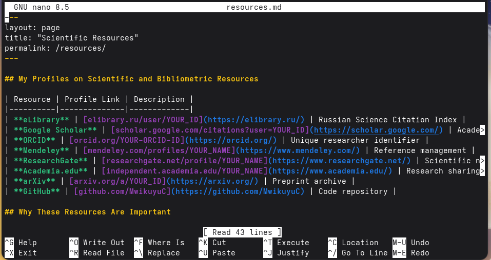

### Создание страницы персональных проектов

Был создан файл `projects.md`, содержащий информацию о выполненных проектах:

- Персональный сайт на GitHub Pages
- Git-репозиторий для курсовых работ
- Лабораторные отчёты в Markdown
- Настройка Fedora Linux в VirtualBox

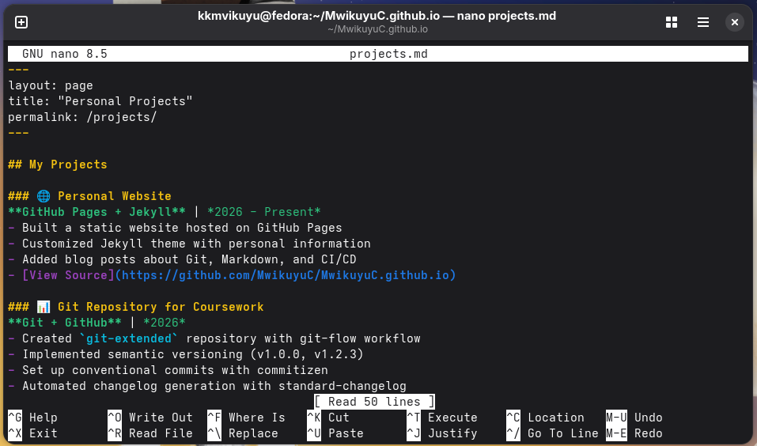

### Обновление навигационного меню

В файл `_config.yml` были добавлены новые страницы в раздел `header_pages`:

```yaml
header_pages:
  - about.md
  - education.md
  - resources.md
  - projects.md
```

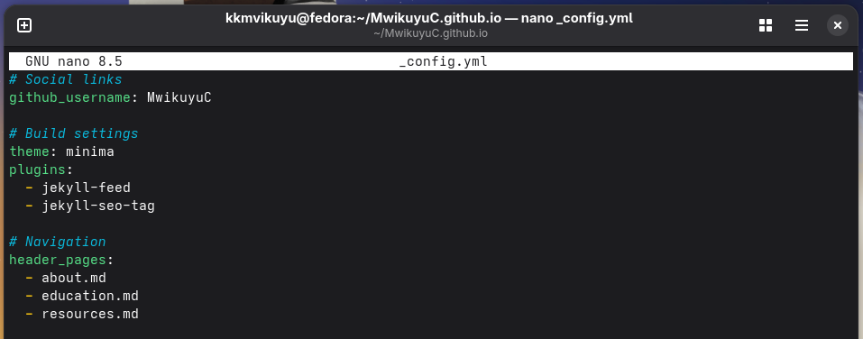
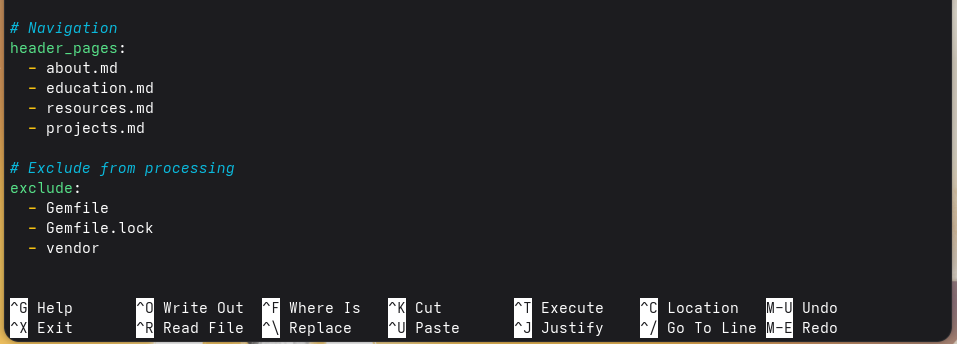

### Создание поста о прошедшей неделе

Был создан файл `_posts/2026-04-15-week-in-review.md` с обзором прошедшей недели. В посте описаны технические достижения, академический прогресс и планы на следующую неделю.

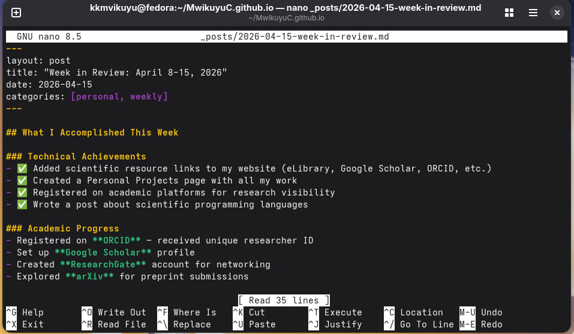

### Создание поста о языках научного программирования

Был создан файл `_posts/2026-04-15-scientific-programming-languages.md`, посвящённый языкам программирования, используемым в научных исследованиях. В посте рассмотрены Python, R, MATLAB, Julia, Fortran и C/C++.

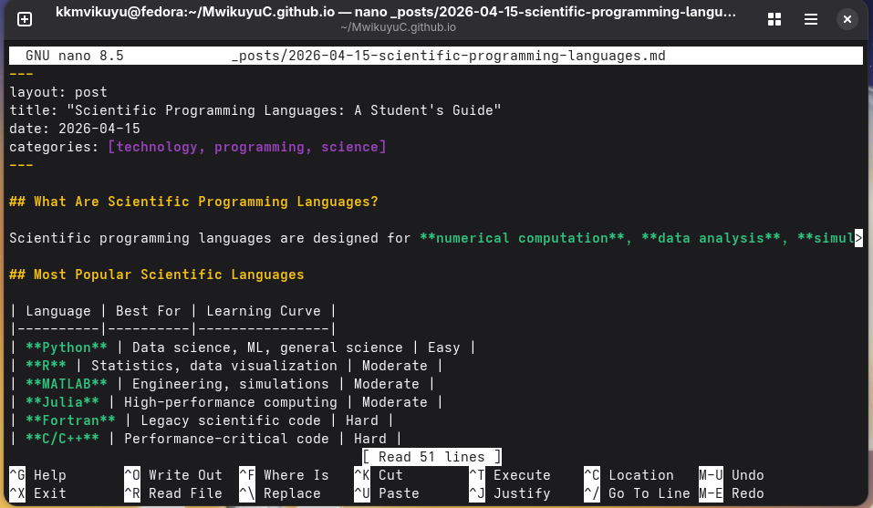

### Публикация изменений

После внесения всех изменений файлы были добавлены в Git, создан коммит и выполнена отправка на GitHub.

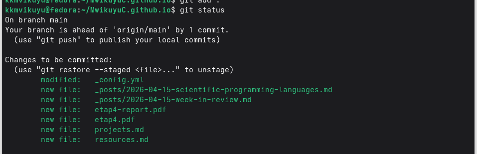
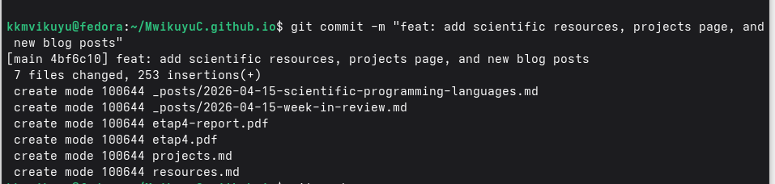
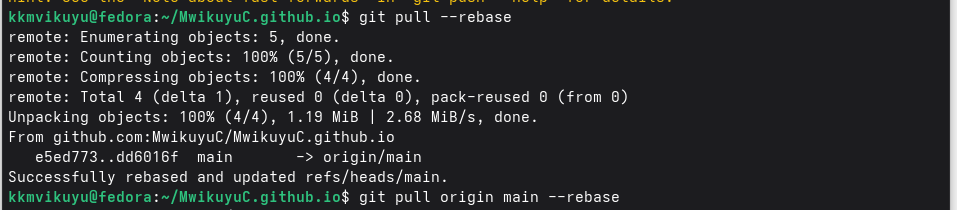
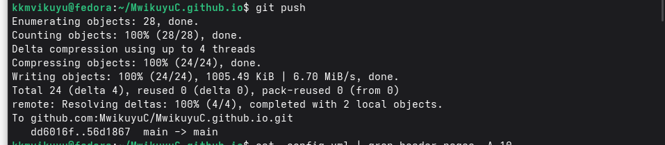

### Проверка конфигурации

Была проверена корректность настройки навигационного меню:

```bash
cat _config.yml | grep header_pages -A 10
```

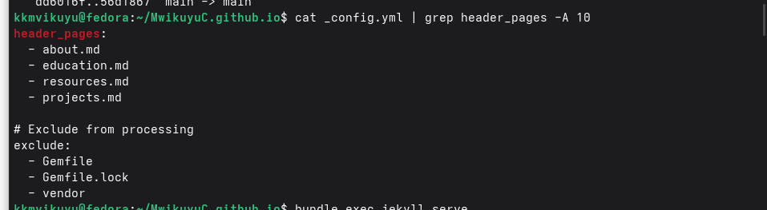

### Установка зависимостей и запуск сайта

Для локального просмотра сайта были установлены необходимые зависимости:

```bash
bundle install
bundle exec jekyll serve
```

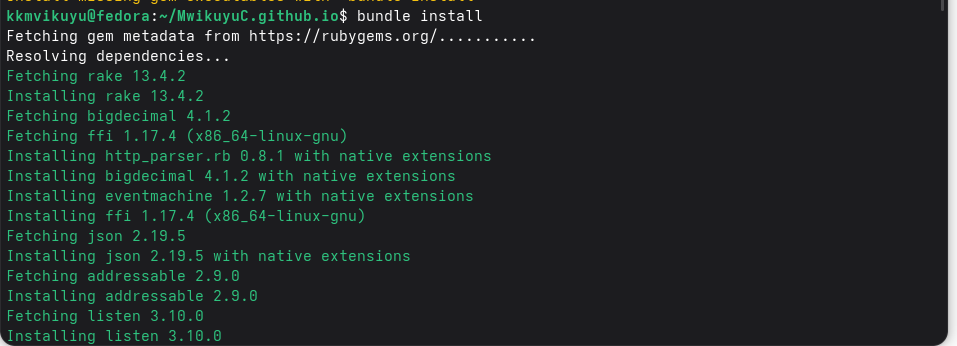
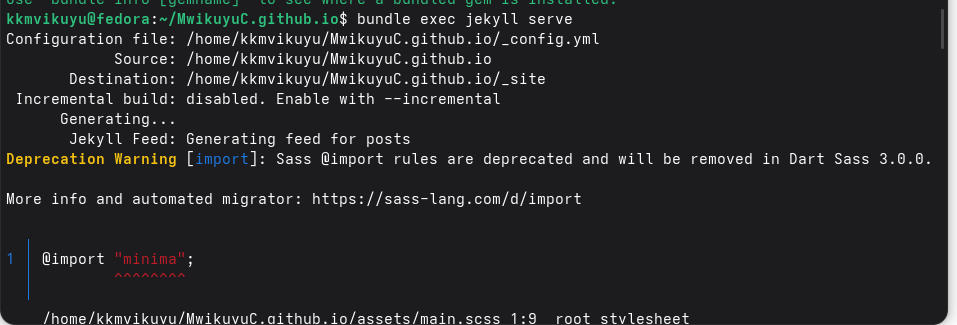

## Результаты

В результате выполнения лабораторной работы персональный сайт был дополнен следующими элементами:

| Элемент | Файл | Статус |
|---------|------|--------|
| Страница научных ресурсов | `resources.md` | ✓ |
| Страница персональных проектов | `projects.md` | ✓ |
| Обновлённая навигация | `_config.yml` | ✓ |
| Пост о прошедшей неделе | `_posts/2026-04-15-week-in-review.md` | ✓ |
| Пост о языках научного программирования | `_posts/2026-04-15-scientific-programming-languages.md` | ✓ |

### Внешний вид сайта

Главная страница сайта после добавления новых постов:

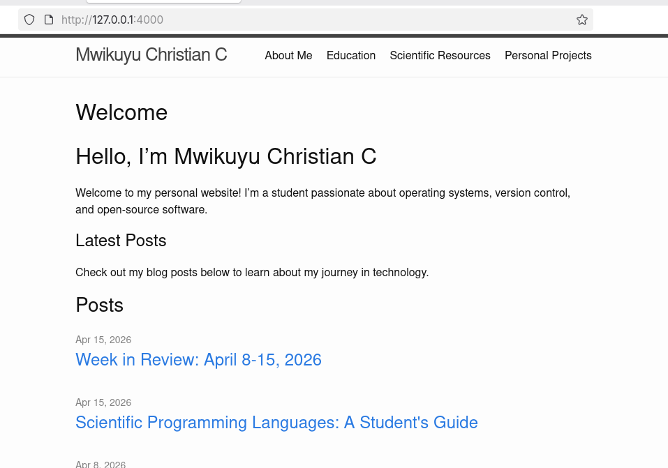

Страница с постом о языках научного программирования:

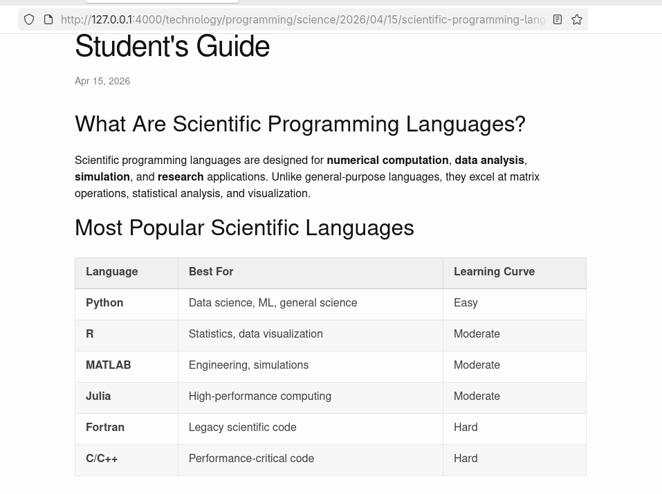

## Заключение

В ходе выполнения лабораторной работы были достигнуты следующие результаты:

1. **Создана страница научных ресурсов** с ссылками на eLibrary, Google Scholar, ORCID, Mendeley, ResearchGate, Academia.edu, arXiv и GitHub.

2. **Создана страница персональных проектов** с описанием выполненных работ.

3. **Обновлено навигационное меню** сайта для доступа к новым страницам.

4. **Создан пост о прошедшей неделе** с описанием технических достижений и академического прогресса.

5. **Создан пост о языках научного программирования** с обзором Python, R, MATLAB, Julia, Fortran и C/C++.

6. **Все изменения опубликованы** на GitHub Pages.

Персональный сайт доступен по адресу: https://MwikuyuC.github.io

## Приложение А. Скриншоты

А.1 Создание страницы resources.md


А.2 Обновление навигационного меню (часть 1)


А.3 Создание страницы projects.md


А.4 Обновление навигационного меню (часть 2)


А.5 Создание поста о прошедшей неделе


А.6 Создание поста о языках научного программирования


А.7 Главная страница сайта


А.8 Пост о языках научного программирования (просмотр)


А.9 Git status


А.10 Git commit


А.11 Git pull --rebase


А.12 Git push


А.13 Проверка конфигурации


А.14 Установка зависимостей


А.15 Запуск Jekyll сервера


---

**Дата выполнения:** 16 апреля 2026 г.

**Студент:** МВИКУЮ КРИСТИАН КРИСТОФЕР

**Группа:** НБИБд-02-25
